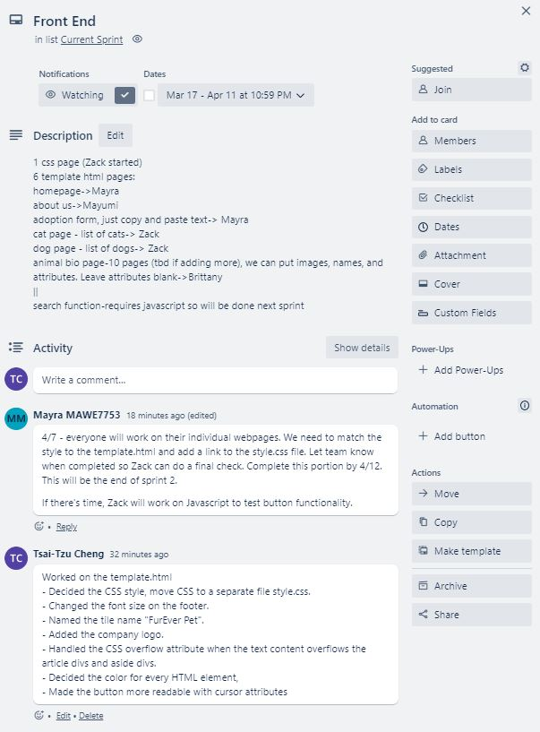
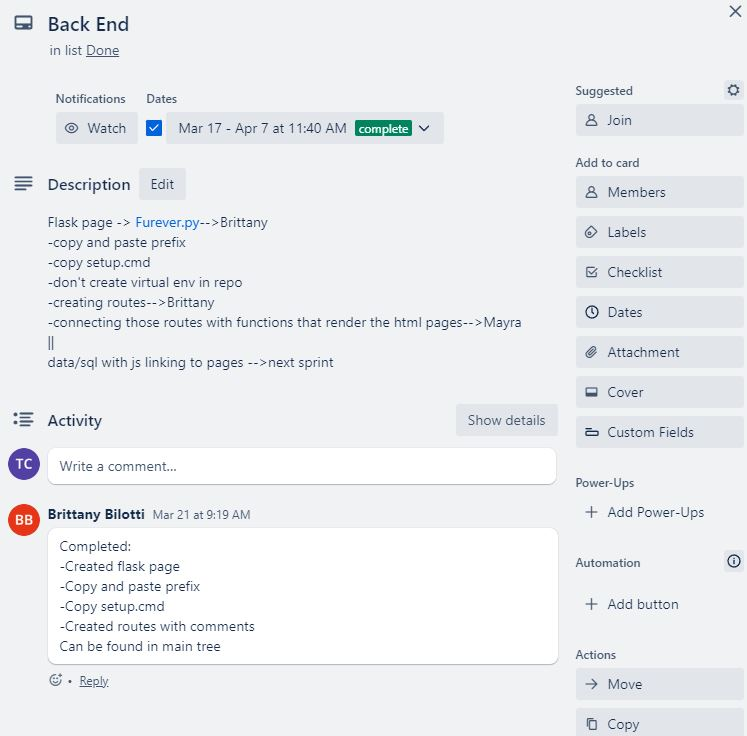
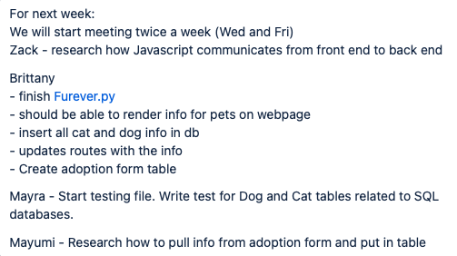
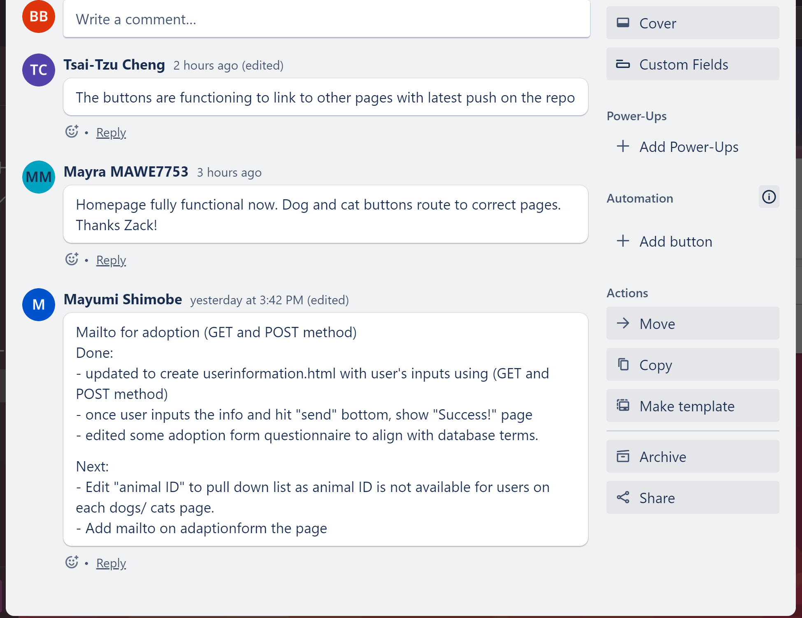
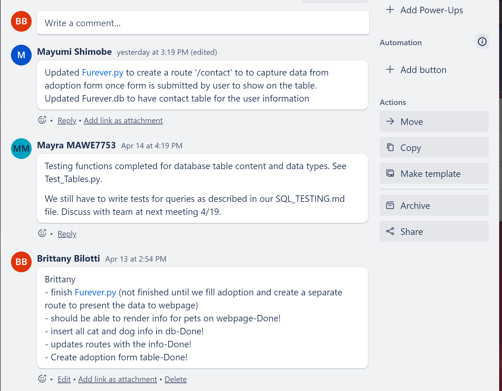
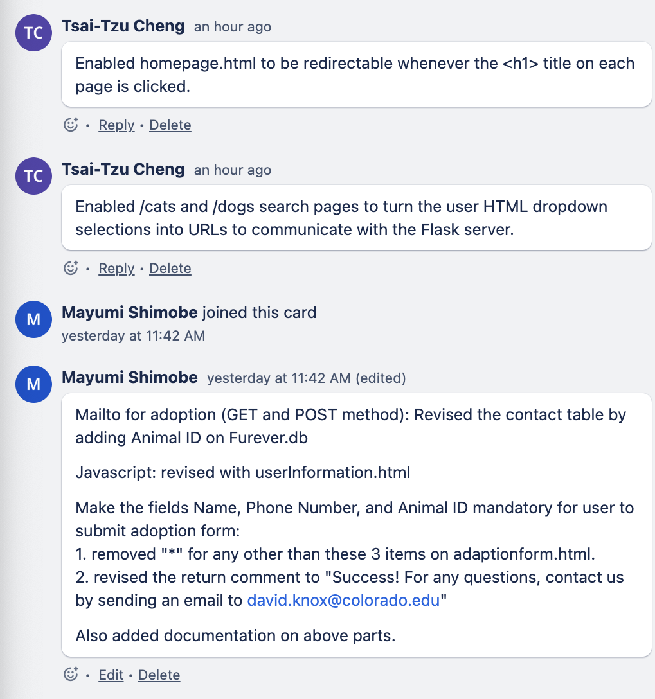
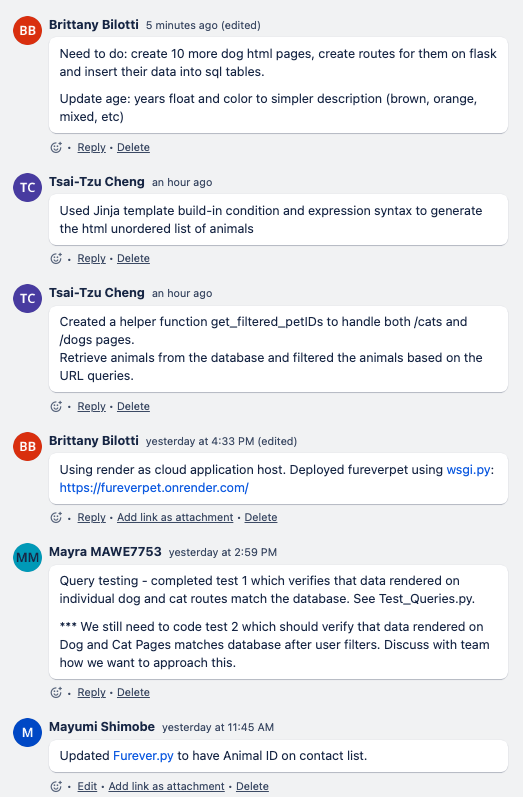
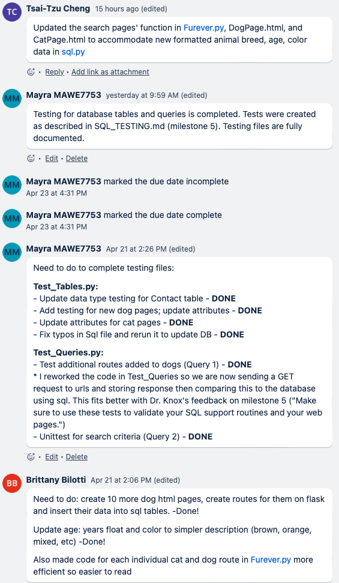

# Week 1
First team meeeting
* Team introductions and planning poker exercise

### Obstacles
* No obstacles to report

#### Goals for next week
* Think of website ideas

# Week 2
* Chose project, created Trello account, and created GitHub repo
  See Readme file [FantasticFour Repo](https://github.com/Fantastic4Project3308/PetRescue)
  See Readme file [FantasticFour Trello](https://trello.com/w/fantasticfour82)

### Obstacles
* No obstacles to report

### Goals for next week
* Search for similar pet adoption websites for inspiration

# Week 3
* Separated tasks into front end and back end

#### Backend
* Selected Petango as the data source
* Created data folders in repo
* Discussed script for web scraping
 

 
#### Frontend
* Discussed homepage design and submitted a rough draft for team review
 
<figure width=100%>
</figure>
 
<figure width=100%></figure>
### Obstacles
* Seattle Humane website had latency issues with loading pet information which causes us to lose html text we scraped. The work around was switching to Petango.com for our data source.
* Frontend didn't have obstacles this week

### Goals for next week
* Create scripts for webscrapping
* Work on a listing of possible web pages based on research from other pet adoption websites

# Week 4
* Continued working on website design and website scrapping script
#### Backend
* Completed 3 scripts to scrape Petango
<figure width=100%>
</figure>
<figure width=100%></figure>

* Stored HTML website data in dog directory. Screen shot below shows a sample of the website HTML files collected.
<figure width=100%>
</figure>
 
<figure width=100%></figure>

#### Frontend
* Created a listing of possible webpages that we'll discuss with the rest of the team during our stand up meeting 3/2. 
<figure width=100%>
</figure>
 
<figure width=100%></figure>
### Obstacles
#### Backend
* Backend didn't have obstacles this week

#### Frontend
* We'll need to consider what data is available and if the webpages are feasible.

### Goals for next week
#### Backend
* Create script to cycle through html files and use pet attributes script to generate attribute files for each animal
* Work with front end to finalize attributes list and complete final edits to web scrapping script

#### Frontend
* Continue designing webpages and how to hyperlink them together (use wix.com if possible)
* Work toward completion of milestone 4
* 

# Week 5
#### Backend
* Created data from cat and dog html and generated ~ 50 files in cat and dog data folders

#### Frontend
* Created a layout design on wix as inspiration
* Created mock up of webpages: home, dog, cat, about us, animal bio, buttons, animal adoption form, and how these pages and buttons would link together
* Worked on project milestone 4 and created parameters for pages
 

 
 

#### Goals for next week
* Finalize sprint
* Discuss next sprint goals for the following week

### Obstacles
* Front and backend did not experience obstacles this week

# Week 6 (Start of new Sprint)
Sprint was finalized and milestone 4 was completed. 

This week, we discussed milestone 5 and decided that it will be completed during our 4/5 meeting as a team.

We also discussed what we'd like to accomplish during this new sprint as detailed below. We expect to have this sprint completed by 4/7.
#### Frontend
* Create css and HTML pages. We split this task up between team members to allow for full team participation.
 

 
 
#### Backend
* Create files to rrender web pages with flask.
 

 
 

#### Goals for next week
* Continue working on current sprint

### Obstacles
* Frontend and backend did not experience obstacles this week

# Week 7
#### Frontend
* Completed/ work-in-progress html pages of Homepage, AdaptionForm, AboutUs, CatPage, and DogPage
* Discussed how html, css, and javascript files would be structured for the website.
 

 

#### Backend
* Continue working on current sprint.
* Created Furever.py file and necessary routes.
 

 
 

#### Goals for next week
* Discuss and complete Milestone 5 on Wednesday April 5th
* Continue working on the html drafts and backend
* Work together on css and other files on April 7th 2023.

### Obstacles
* Front and backend did not experience obstacles this week

# Week 8
#### Frontend
* Worked on the css themes/styles that applies to webpages.
 

 
 

#### Backend
* Completed:
 

* Milestone 5 was completed

 
 

#### Goals for next week
* 4/7 - everyone will work on their individual webpages. We need to match the style to the template.html and add a link to the style.css file. Let team know when completed so Zack can do a final check. Complete this portion by 4/12. This will be the end of sprint 2.
* If there's time, Zack will work on Javascript to test button functionality.
* We'll start sprint 3 as a team during our 4/13 zoom meeting.

### Obstacles
* Try to figure out how to link the webpage through the `<a>` tag.
* Try to fit the image inside the div.

# Week 9 (Start of Sprint 3)
***Going forward, the team will meet twice of week to complete project by 4/28
#### Frontend
* Completed rework of individual webpages. Style now matches template. Pages that did not fit the template were styled individually for better readibility

#### Backend
* Coded as a team and figured out how to render data pulled from SQL onto Webpage. Brittany will finish this up.

#### Goals for next week
 

Push to get these items done by Wednesday meeting. We'll decide what to do next on Wednesday.

### Obstacles
#### Frontend
Zack - reasearch why the css is not rendering when we run webpage with Flask. It renders find when we use HTML viewer.

#### Backend
No obstacles this week.

# Week 10
## Meeting 1 Wednesday 4/19
#### Frontend
 

* Updated to create userinformation.html with user's inputs using GET and POST method
* Edited adoption form questionnaire to align with database terms
* Made sure buttons that link to other pages are functioning

#### Backend
* Rendered data pulled from SQL onto Webpage
* Testing functions created and completed for database table content and data types 
* Created route '/contact' to to capture data from adoption form once form 
 

#### Goals for Friday
* Add animal ID to pull down list 
* Add mailto on adaptionform the page
* Complete all drop down selections for cat and dog search pages so that it can load animal based on preferences
* Complete query testing 
* Deploy Flask app

### Obstacles
#### Frontend
* Zack- make sure selections render correct cat and dogs

#### Backend
* Mayumi- making adoption form table information render dynamic
* Mayra- how to approach further query testing 

# Week 10
## Meeting 2 Friday 4/21
#### Frontend
 
 
* Continue working all drop down selections for cat and dog search pages so that it can load animal based on preferences
* Discussed on criteria of screening (breed/ age (float)/ color)

#### Backend
 
 
* Rendered data pulled from SQL onto Webpage
* Discussed how we test the search function

#### Deployment/ Documentation
* Deploied Flask app
* Updated README.md for usage

#### Goals for next week
* Complete all drop down selections for cat and dog search pages so that it can load animal based on preferences
* Add more Cat and Dog pages
* update query testing once more cat and dog pages are added
* For Query 1 Test 2 (testing the search engine), test from backend.
* Revise README.md, linking other documents like PAGE_TESTING.md (WebsiteDesign/MOCK_UP.md) for final submission

### Obstacles
#### Backend
* Britteny - figure our how to make Furever.py up and running on Render.com (made wsgi.py and requirements.txt)

# Week 11
## Meeting Wednesday 4/26 (End of Sprint 3)
#### Frontend
* Code clean up/ final check for all functionality
* Enabled filtering on DOg and Cat pages
* This marks end of sprint 3

#### Backend
 
 
* Completed all front end goals from last meeting
* This marks end of sprint 3

#### Deployment/ Documentation
* Documentation started for Milestone 7 and 8

#### Goals for Friday
* Start Sprint 4 (final sprint) - work on slide deck for group presentation (milestone 7) and assign slides

### Obstacles
No obstacles

