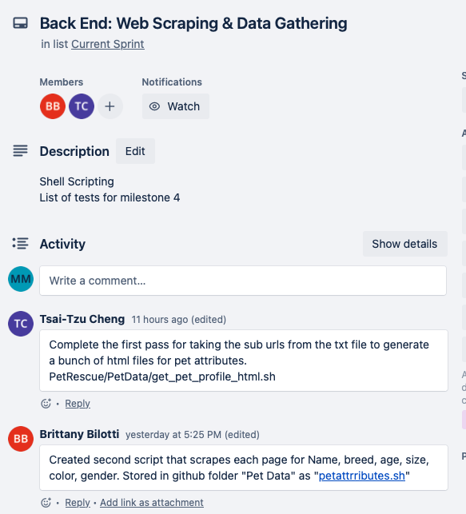
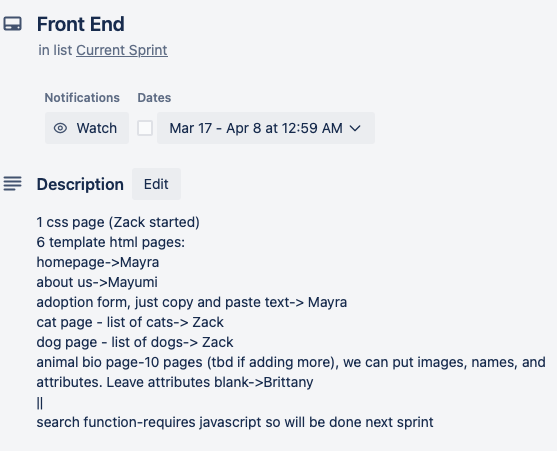
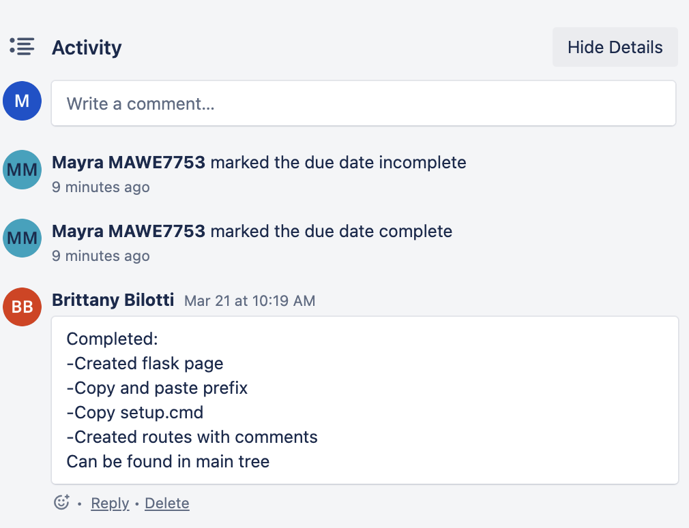

# Week 1
First team meeeting
* Team introductions and planning poker exercise

### Obstacles
* No obstacles to report

#### Goals for next week
* Think of website ideas

# Week 2
* Chose project, created Trello account, and created GitHub repo
  See Readme file [FantasticFour Repo](https://github.com/Fantastic4Project3308/PetRescue)
  See Readme file [FantasticFour Trello](https://trello.com/w/fantasticfour82)

### Obstacles
* No obstacles to report

### Goals for next week
* Search for similar pet adoption websites for inspiration

# Week 3
* Separated tasks into front end and back end

#### Backend
* Selected Petango as the data source
* Created data folders in repo
* Discussed script for web scraping
 

 
#### Frontend
* Discussed homepage design and submitted a rough draft for team review
 
<figure width=100%>
</figure>
 
<figure width=100%></figure>
### Obstacles
* Seattle Humane website had latency issues with loading pet information which causes us to lose html text we scraped. The work around was switching to Petango.com for our data source.
* Frontend didn't have obstacles this week

### Goals for next week
* Create scripts for webscrapping
* Work on a listing of possible web pages based on research from other pet adoption websites

# Week 4
* Continued working on website design and website scrapping script
#### Backend
* Completed 3 scripts to scrape Petango
<figure width=100%>
</figure>
<figure width=100%></figure>

* Stored HTML website data in dog directory. Screen shot below shows a sample of the website HTML files collected.
<figure width=100%>
</figure>
 
<figure width=100%></figure>

#### Frontend
* Created a listing of possible webpages that we'll discuss with the rest of the team during our stand up meeting 3/2. 
<figure width=100%>
</figure>
 
<figure width=100%></figure>
### Obstacles
#### Backend
* Backend didn't have obstacles this week

#### Frontend
* We'll need to consider what data is available and if the webpages are feasible.

### Goals for next week
#### Backend
* Create script to cycle through html files and use pet attributes script to generate attribute files for each animal
* Work with front end to finalize attributes list and complete final edits to web scrapping script

#### Frontend
* Continue designing webpages and how to hyperlink them together (use wix.com if possible)
* Work toward completion of milestone 4
* 

# Week 5
#### Backend
* Created data from cat and dog html and generated ~ 50 files in cat and dog data folders

#### Frontend
* Created a layout design on wix as inspiration
* Created mock up of webpages: home, dog, cat, about us, animal bio, buttons, animal adoption form, and how these pages and buttons would link together
* Worked on project milestone 4 and created parameters for pages
 

 
 

#### Goals for next week
* Finalize sprint
* Discuss next sprint goals for the following week

### Obstacles
* Front and backend did not experience obstacles this week

# Week 6 (Start of new Sprint)
Sprint was finalized and milestone 4 was completed. 

This week, we discussed milestone 5 and decided that it will be completed during our 4/5 meeting as a team.

We also discussed what we'd like to accomplish during this new sprint as detailed below. We expect to have this sprint completed by 4/7.
#### Frontend
* Create css and HTML pages. We split this task up between team members to allow for full team participation.
 

 
 
#### Backend
* Create files to rrender web pages with flask.
 

 
 

#### Goals for next week
* Continue working on current sprint

### Obstacles
* Front and backend did not experience obstacles this week

# Week 7
#### Frontend
* Completed/ work-in-progress html pages of Homepage, AdaptionForm, AboutUs, CatPage, and DogPage
* Discussed how html, css, and javascript files would be structured for the website.
 

 

#### Backend
* Continue working on current sprint.
* Created Furever.py file and necessary routes.
 

 
 

#### Goals for next week
* Discuss and complete Milestone 5 on Wednesday April 5th
* Continue working on the html drafts and backend
* Work together on css and other files on April 7th 2023.

### Obstacles
* Front and backend did not experience obstacles this week

# Week 12
#### Frontend
* N/A
 
 

#### Backend
* Worked out and uploaded the SQL Design markdown file onto the repo. [SQL_TESTING.md](https://github.com/Fantastic4Project3308/PetRescue/blob/main/SQL_TESTING.md).
 

 
 

#### Goals for next week
* 

### Obstacles
* 
